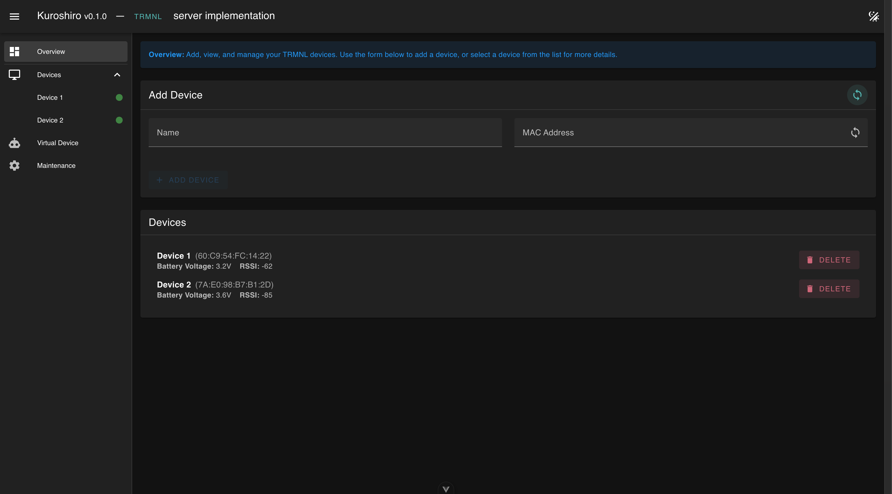
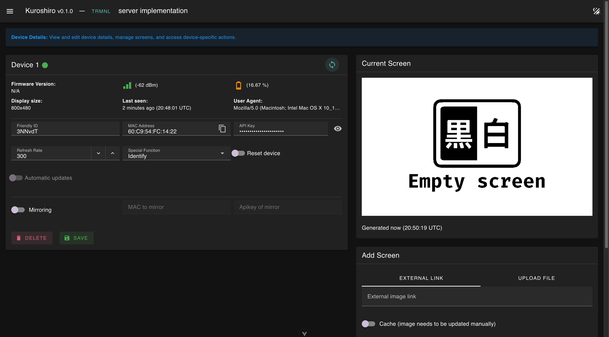
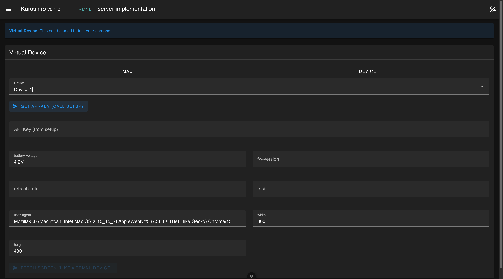
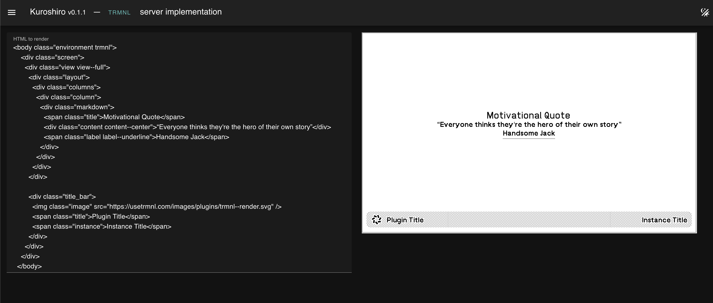

  

# KUROSHIRO: Unleash Your TRMNL!

**Kuroshiro** is an open-source BYOS (Bring Your Own Server) solution for the [TRMNL](https://usetrmnl.com/) ecosystem. Our goal is to give you more flexibility and control over your TRMNL experience, whether you're self-hosting for fun, learning, or customization. Kuroshiro bundles a [NestJS](https://nestjs.com/) API and a [Vue.js](https://vuejs.org/) UI into a single Docker image, ready to run alongside your own Postgres database.

---

## ⚠️ Alpha Notice

> **Heads up!** Kuroshiro is still in **alpha** and not feature complete. Things are moving fast, and breaking changes may happen. Updates might require you to wipe your data and start fresh. Until we reach version 1.0.0, backward compatibility is not guaranteed. Please keep this in mind if you decide to try it out!

---

## 🌟 Why Kuroshiro?

Kuroshiro is for anyone who wants to experiment, self-host, and shape their own TRMNL experience:
- **Self-hosted**: Your data, your rules, your server.
- **All-in-one**: API (NestJS) + UI (Vue 3 + Vuetify) bundled together.
- **Plug & Play**: Just add Postgres and go!
- **Fun to use**: Modern, intuitive, and built for tinkerers and pros alike.

---

## ✨ Features at a Glance

- **Auto Provisioning**: Devices set up themselves—like magic!
- **Device Management**: Rename, reset, tweak refresh rates, and more.
- **Live Device Insights**: WiFi, battery, firmware, and real-time previews.
- **Mirroring**: See what's on your official TRMNL server, right here.
- **Screens Galore**: Add screens via link or upload, cache them, or fetch fresh every time.
- **Virtual Device**: Test without hardware—because why not?

---

## Live Demo

A live demo can be found [here](https://kuroshiro-demo.phyberapex.de/)

---

## 🗺️ Roadmap & Planned Features

We're constantly working to make Kuroshiro even better! Here's what's on our roadmap, organized by priority:

### 🔥 High Priority
- [ ] **Device Logs Viewer** - View logs directly from your TRMNL devices for better debugging and monitoring
- [x] **Refresh Rate UI Controls** - Adjust device refresh rates directly from the web interface
- [ ] **Screen Management** - Switch active screens and reorder them directly in the UI

### 🎯 Medium Priority  
- [ ] **Liquid Template Syntax** - Add Liquid templating support for dynamic HTML screens
- [ ] **Maintenance Dashboard** - Clean up unused images and manage disk space efficiently
- [ ] **Recipes Support** - Pre-built screen templates and configurations you can easily apply
- [ ] **Screen Mashups** - Combine multiple screens into custom layouts

### 🔮 Future Enhancements
- [ ] **System Logs Viewer** - Internal system logging and monitoring capabilities  
- [ ] **Smart Image Caching** - Intelligent caching algorithms to optimize storage and performance
- [ ] **Screen Playlists** - Create playlists that cycle through multiple screens automatically

> **Want to contribute?** Pick a feature from the roadmap and help us build it! Check out our [contribution guidelines](#-contribute--make-kuroshiro-even-better) below.

---

## Screenshots

Overview

  

Device Details

  

Virtual Device

  

HTML Preview

  

---

## 🐳 Dockerized & Ready to Roll

Kuroshiro is built for Docker. Just bring your own Postgres database and you're set!

We build these tags automatically:

| Tag    | Content                                                                  |
|--------|--------------------------------------------------------------------------|
| next   | Always build from the latest code changes in `main`                      |
| latest | The newest released version                                              |
| x.x.x  | Specific version that has been built and can be found in GitHub releases |

For local hacking or deployment inspiration, check out [`docker-compose.yml`](./docker-compose.yml). It spins up everything you need—API, UI, and Postgres—so you can get started in seconds.

---

## 📦 Packages

- [`packages/api`](./packages/api) — The NestJS backend
- [`packages/ui`](./packages/ui) — The Vue 3 + Vuetify frontend

---

## 🚀 Quick Start (Dev Mode)

1. **Clone** this repo
2. **Install** dependencies: `pnpm install`
3. **Create** a `.env` file (use `env.example` and replace `${MY_IP}`)
4. **Run Kuroshiro**:
   - With Docker: `docker-compose up` (full local stack)
   - Or, start Postgres manually and run: `pnpm run dev`

---

## 🖥️ How Screens Work

### Mirroring from Official Server
If you enable mirroring and provide the MAC and apikey, Kuroshiro fetches the current screen (`api/current_screen`) from the official server—mirroring always takes priority. If the given MAC to mirror matches with the one of the device itself we are entering "proxy-mode" where we get the current display from the actual endpoint (`display`) and forward all the headers back and forth.

### Screens Managed by Kuroshiro
Screens can be added after your device fetches a screen at least once (so we know its size!).

#### Uploaded Screens
Upload a file and Kuroshiro uses Imagemagick to fit, fill, and convert it to black and white. Stored locally, ready to go.

#### External Link Screens
Provide a URL and Kuroshiro fetches, converts, and serves it. Cache it for speed, or fetch fresh every time—your choice!

#### HTML Screens
Provide HTML you can make use of the [TRMNL framework](https://usetrmnl.com/framework). You can use the tool "HTML Preview" to help generate HTML.

---

## 🤝 Contribute & Make Kuroshiro Even Better!

We love contributions! Jump in:
- Open issues or join discussions for bugs, ideas, or questions
- Fork, branch, and submit pull requests (PRs)—all PRs welcome!
- Please follow our code of conduct and code style
- Run all tests before submitting a PR
- **We use [release-please](https://github.com/googleapis/release-please)!** Use [Conventional Commits](https://www.conventionalcommits.org/) for your commit messages to enable automatic versioning and changelogs.

---

## 💡 Ready to Take Control?

Kuroshiro is all about giving you the power to shape your TRMNL experience. Self-host, customize, and have fun—your TRMNL, your way.

Happy self-hosting with Kuroshiro! ✨ 
