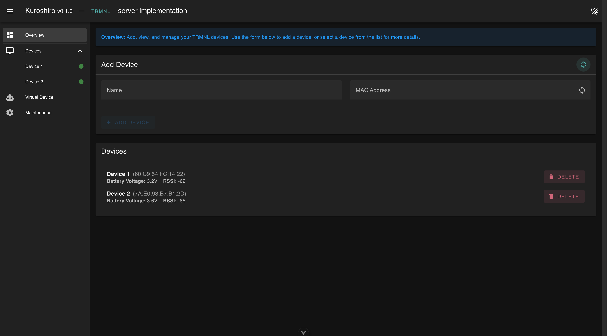
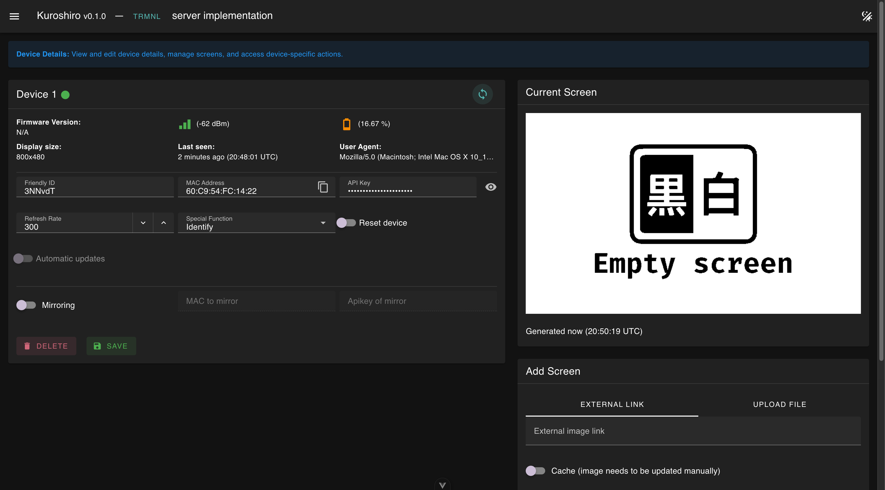
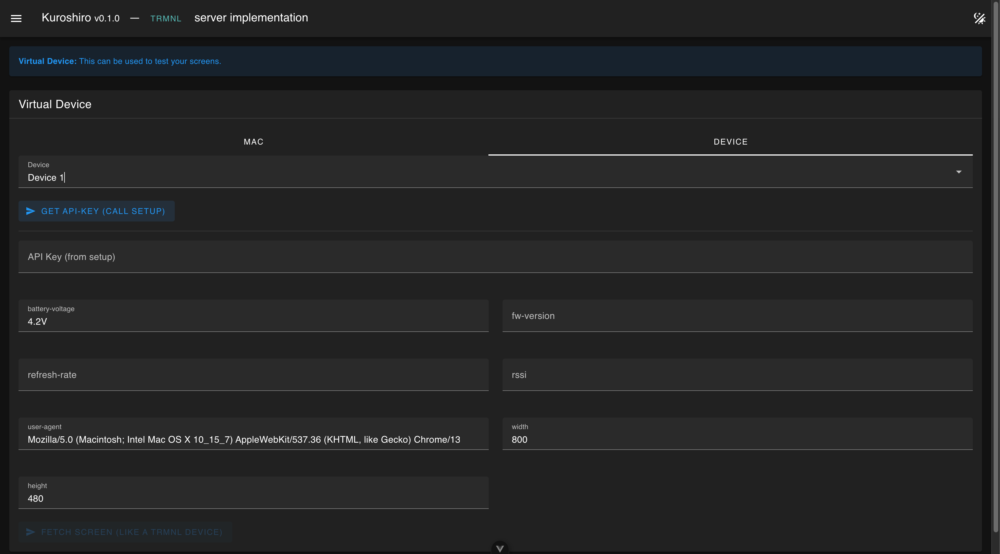
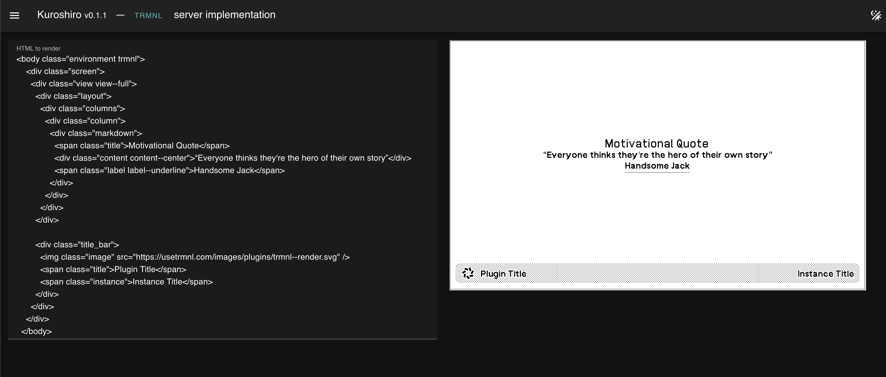

[](https://github.com/PhyberApex/kuroshiro/actions/workflows/docker-next.yml)
[](https://github.com/PhyberApex/kuroshiro/releases)
[](https://codecov.io/gh/PhyberApex/kuroshiro)
[](https://github.com/PhyberApex/kuroshiro/stargazers)

<p align="center">
  
</p>

# KUROSHIRO: Unleash Your TRMNL!

**Kuroshiro** is an open-source BYOS (Bring Your Own Server) solution for the [TRMNL](https://usetrmnl.com/) ecosystem. Our goal is to give you more flexibility and control over your TRMNL experience, whether you're self-hosting for fun, learning, or customization. Kuroshiro bundles a [NestJS](https://nestjs.com/) API and a [Vue.js](https://vuejs.org/) UI into a single Docker image, ready to run alongside your own Postgres database.

---

## ⚠️ Alpha Notice

> **Heads up!** Kuroshiro is still in **alpha** and not feature complete. Things are moving fast, and breaking changes may happen. Updates might require you to wipe your data and start fresh. Until we reach version 1.0.0, backward compatibility is not guaranteed. Please keep this in mind if you decide to try it out!

---

## 🌟 Why Kuroshiro?

Kuroshiro is for anyone who wants to experiment, self-host, and shape their own TRMNL experience:
- **Self-hosted**: Your data, your rules, your server.
- **All-in-one**: API (NestJS) + UI (Vue 3 + Vuetify) bundled together.
- **Plug & Play**: Just add Postgres and go!
- **Fun to use**: Modern, intuitive, and built for tinkerers and pros alike.

---

## ✨ Features at a Glance

- **Auto Provisioning**: Devices set up themselves—like magic!
- **Device Management**: Rename, reset, tweak refresh rates, and trigger one-shot Special Functions (identify, sleep, add Wi-Fi, rewind).
- **Multi-Size Device Support**: Every panel size and colour depth TRMNL sells, synced daily from the official model list, plus admin-created custom colour palettes.
- **Live Device Insights**: WiFi, battery, firmware version, Qwiic sensor readings (CO₂, humidity, pressure, temperature), and real-time previews.
- **Mirroring**: See what's on your official TRMNL server, right here.
- **Screens Galore**: Add screens via link or upload, cache them, or fetch fresh every time—then gate any of them to a day/time Schedule.
- **Plugins**: Poll external APIs (with multiple named Data Sources per plugin) or accept pushed Webhooks, render them with Liquid, or import a Recipe straight from trmnl.com.
- **Firmware Management**: Official releases sync automatically, or push a custom OTA build, with per-Device-Model compatibility checks so you can't flash the wrong binary.
- **Virtual Device**: Test without hardware—because why not?

---

## ⚖️ Kuroshiro vs. the rest of the TRMNL ecosystem

Kuroshiro isn't the only way to run a TRMNL: the device also works with the official [trmnl.com](https://trmnl.com/) cloud, and with [Terminus](https://github.com/usetrmnl/terminus)—the other open-source, self-hosted BYOS. Here's how they line up today:

| | **Kuroshiro** | [**Terminus**](https://github.com/usetrmnl/terminus) | **Official TRMNL Cloud** |
|---|---|---|---|
| Hosting | Self-hosted, one Docker image (NestJS + Vue) + your own Postgres | Self-hosted (Docker/K8s/Raspberry Pi), Ruby/Hanami + Postgres + Redis/Sidekiq | Managed SaaS, closed source |
| Cost | Free, MIT-licensed | Free, MIT-licensed | Free tier + paid "Developer Edition" for custom plugins; device sold separately |
| Accounts | Single admin, no login | Multi-user accounts with email verification | Cloud account required |
| Device models & palettes | Full official catalog synced daily, plus admin-created custom colour Palettes | Device models & palettes supported | Defines the catalog—sells the hardware |
| Plugins | `Poll` (multiple named Data Sources, each fetched or a literal value) & `Webhook` (3 merge strategies) | "Extensions"/Exchanges, single- or multi-source polling | 1,000+ native, community & private plugins |
| Recipe import | Imports any trmnl.com Recipe, including serverless-transform ones Terminus's importer rejects | Imports via its Extension Gallery | Native—it's the source catalog |
| Screen scheduling | Per-Screen day/time Schedule gates rotation eligibility | Playlist model: weekday/date windows, skip-if-stale TTL, device-grouped playlists | Playlist Scheduler, group scheduling by time of day |
| Mashups | 7 layouts | Supported | 8 layouts |
| Firmware | Official sync + custom OTA upload, hard-blocked unless the Firmware is compatible with the Device's model | Official sync + custom upload, no model-compatibility link | Manages its own hardware directly |
| Sensors | Device-attached Qwiic sensors (CO₂/humidity/pressure/temperature), exposed to Plugin templates | Device-attached *and* server-attached (Raspberry Pi) sensors | — |
| Sleep Mode | Not yet—on the [roadmap](#-roadmap--planned-features) | Supported | Supported |

The short version: Kuroshiro trades Terminus's multi-user accounts and device-grouped playlists for a simpler single-admin, single-container deployment, while going further than either self-hosted option on per-Device-Model firmware safety and mixed fetch/literal Data Sources within one Plugin. See [`docs/adr`](./docs/adr) for the design decisions (and prior-art comparisons) behind each of these.

---

## 🌐 Live Demo

Want to see Kuroshiro in action before diving in? We've got you covered! Check out our live demo at [kuroshiro-demo.phyberapex.de](https://kuroshiro-demo.phyberapex.de/) where you can:

- **Explore the interface** - Navigate through device management, screen creation, and all the core features
- **Test virtual devices** - Play around with the virtual device feature to see how screens render
- **Try screen creation** - ~~Upload images~~ (This is not supported in the demo), add external links, or craft custom HTML screens
- **See real-time updates** - Watch how the system handles device communication and screen management

> **Note:** The demo will reset once a day, so you can explore freely without worrying about breaking anything. It's the perfect playground to get a feel for Kuroshiro before setting up your own instance!

---

## 🛠️ Technology used

Kuroshiro is built on a modern, robust tech stack designed for performance, developer experience, and maintainability. Here's what powers the magic under the hood:

### General

[](https://pnpm.io/)

[](https://www.docker.com/)
[](https://vitest.dev/)

**Why this foundation?** We chose **pnpm** for lightning-fast package management and efficient monorepo handling. **PostgreSQL** gives us rock-solid data reliability with advanced features for complex queries. **Docker** ensures consistent deployments across any environment, and **Vitest** provides blazing-fast testing with excellent TypeScript support.

### API

[](https://nestjs.com/)
[](https://typeorm.io/)

**The backend powerhouse:** **NestJS** brings enterprise-grade architecture with decorators, dependency injection, and built-in TypeScript support—perfect for building scalable APIs. **TypeORM** handles our database operations with elegant Active Record patterns and automatic migrations, making data management a breeze.

### UI

[](https://vuejs.org/)
[](https://vuetifyjs.com/)
[](https://vite.dev/)

**Frontend excellence:** **Vue 3** delivers reactive, component-based UI development with incredible performance and developer ergonomics. **Vuetify** provides beautiful Material Design components out of the box, ensuring a polished, accessible interface. **Vite** powers our build process with instant hot module replacement and optimized production builds.

---

## 🗺️ Roadmap & Planned Features

We're constantly working to make Kuroshiro even better! Here's what's on our roadmap, organized by priority:

### 🔥 High Priority
- [ ] **Device Logs Viewer** - View logs directly from your TRMNL devices for better debugging and monitoring
- [x] **Refresh Rate UI Controls** - Adjust device refresh rates directly from the web interface
- [x] **Screen Reordering** - Drag-and-drop screens into the order you want them to play
- [ ] **Sleep Mode** - Per-Device night window that pauses rotation and lets the Device sleep through it instead of polling on its usual cadence

### 🎯 Medium Priority  
- [x] **Liquid Template Syntax** - Plugins render with Liquid, including Data Sources and Mashups; HTML Screens are still raw HTML
- [x] **Maintenance Dashboard** - Clean up unused images, manage disk space, and manage Firmware
- [x] **Recipes Support** - Import any TRMNL Recipe from trmnl.com straight into a Poll Plugin
- [x] **Screen Mashups** - Combine multiple plugin screens into custom layouts (7 layouts supported!)
- [x] **Screen Playlists** - Gate any Screen to a recurring day/time Schedule so rotation skips it outside that window

### 🔮 Future Enhancements
- [x] **System Logs Viewer** - Internal system logging and monitoring capabilities  
- [ ] **Smart Image Caching** - Intelligent caching algorithms to optimize storage and performance
- [ ] **Device Grouping** - Share one Schedule/rotation across multiple Devices
- [ ] **Server-Attached Sensors** - Sensor data from a self-hosted Raspberry Pi, independent of what a Device itself reports

> **Want to contribute?** Pick a feature from the roadmap and help us build it! Check out our [contribution guidelines](#-contribute--make-kuroshiro-even-better) below.

---

## Screenshots

Overview
<p align="center">
  
</p>

Device Details
<p align="center">
  
</p>

Virtual Device
<p align="center">
  
</p>

HTML Preview
<p align="center">
  
</p>

---

## 🐳 Dockerized & Ready to Roll

Kuroshiro is built for Docker. Just bring your own Postgres database and you're set!

We build these tags automatically:

| Tag    | Content                                                                  |
|--------|--------------------------------------------------------------------------|
| next   | Always build from the latest code changes in `main`                      |
| latest | The newest released version                                              |
| x.x.x  | Specific version that has been built and can be found in GitHub releases |

For local hacking or deployment inspiration, check out [`docker-compose.yml`](./docker-compose.yml). It spins up everything you need—API, UI, and Postgres—so you can get started in seconds.

---

## 📦 Packages

- [`packages/api`](./packages/api) — The NestJS backend
- [`packages/ui`](./packages/ui) — The Vue 3 + Vuetify frontend
- [`packages/shared`](./packages/shared) — Code that is byte-identical in the API and UI

---

## 🚀 Quick Start (Dev Mode)

1. **Clone** this repo
2. **Install** dependencies: `pnpm install`
3. **Create** a `.env` file (use `env.example` and replace `${MY_IP}`)
4. **Run Kuroshiro**:
   - With Docker: `docker-compose up` (full local stack)
   - Or, start Postgres manually and run: `pnpm run dev`

To start postgres in docker you can run
```
export $(cat .env | xargs) && \
docker run \
--env-file .env \
-e POSTGRES_USER=${KUROSHIRO_DB_USER} \
-e POSTGRES_PASSWORD=${KUROSHIRO_DB_PASSWORD} \
-e POSTGRES_DB=${KUROSHIRO_DB_DB} \
-p 5432:5432 \
postgres:18-alpine
```

---

## 🖥️ How Screens Work

### Mirroring from Official Server
If you enable mirroring and provide the MAC and apikey, Kuroshiro fetches the current screen (`api/current_screen`) from the official server—mirroring always takes priority. If the given MAC to mirror matches with the one of the device itself we are entering "proxy-mode" where we get the current display from the actual endpoint (`display`) and forward all the headers back and forth.

### Screens Managed by Kuroshiro
Images are generated for the device's **Device Model** (panel size, colour depth, rotation), which Kuroshiro resolves from what the firmware reports (`Model` header, then reported width×height) and which you can override per device under *Advanced*. The model list is synced from the official TRMNL server (`/api/models`) on startup and daily, with a bundled snapshot as offline fallback — see *Maintenance → Device Models*. Devices without a resolved model render as a TRMNL OG (800×480).

#### Uploaded Screens
Upload a file and Kuroshiro uses ImageMagick to fit it onto the device's panel (letterboxed, rotated if the model needs it) and dither it to the device's palette — 1-bit, 4 or 16 grays, or the colours of a colour panel. The original is kept, so switching a device's model or palette re-generates the image from the source.

#### External Link Screens
Provide a URL and Kuroshiro fetches, converts, and serves it. Cache it for speed, or fetch fresh every time—your choice!

#### HTML Screens
Provide HTML you can make use of the [TRMNL framework](https://usetrmnl.com/framework). You can use the tool "HTML Preview" to help generate HTML.

#### Mashup Screens
Combine multiple plugin outputs into a single screen using one of 7 available layouts:
- **1L×1R** - One left panel, one right panel (50/50 split)
- **1T×1B** - One top panel, one bottom panel (50/50 split)
- **1L×2R** - One large left panel, two stacked right panels
- **2L×1R** - Two stacked left panels, one large right panel
- **2T×1B** - Two side-by-side top panels, one bottom panel
- **1T×2B** - One top panel, two side-by-side bottom panels
- **2×2** - Four equal panels in a 2×2 grid

Mashups use the official TRMNL CSS framework for consistent styling. If a plugin fails to render, an error placeholder is shown instead—allowing the rest of the mashup to display successfully (partial rendering).

#### Screen Schedules
Attach a Schedule to any Screen (including a Mashup) to gate when it's eligible to become the active one: a weekday selection, a daily time-of-day window (which can cross midnight), an optional active date range, and its own enabled/disabled toggle. Rotation simply skips Screens that aren't currently eligible—no gaps, no reordering. A Screen with no Schedule is always eligible.

---

## 🔌 Plugins

Plugins pull outside data into a [Liquid](https://shopify.github.io/liquid/)-rendered template, in one of two ways:

- **Poll**: Kuroshiro fetches on a shared `refreshInterval`. A Poll Plugin can hold multiple named **Data Sources**—each its own HTTP request (method, URL, headers, body, optional JS transform) or a literal, hand-entered JSON value—fetched in parallel and exposed to the template under its own name. If one source fails, the rest still render.
- **Webhook**: an external system `POST`s JSON to the Plugin's own token-secured URL, and Kuroshiro renders on arrival. Choose how each POST combines with what's already stored—replace outright (`standard`), recursively merge objects (`deep_merge`), or append to an array up to a configurable limit (`stream`).

Don't want to build a Plugin from scratch? Paste a Recipe's id or [trmnl.com/recipes](https://trmnl.com/recipes) URL and Kuroshiro imports it as a ready-to-use Poll Plugin. For OG devices with a Qwiic sensor add-on attached, CO₂, humidity, pressure and temperature readings are parsed straight off the device's poll and exposed to every template as `sensors.*`—no extra setup required.

---

## 🔧 Firmware & Device Models

Kuroshiro tracks the official TRMNL model list and the latest official firmware automatically (synced daily, with a bundled snapshot as offline fallback), or you can upload a custom `.bin` build of your own. Every Firmware carries a SHA-256 checksum and an optional set of compatible Device Models, so assigning one to a Device is blocked outright if it doesn't match that Device's hardware—no accidental bricking. Pushes are always explicit: pick a Firmware for a Device under *Maintenance*, and it's served on that Device's next poll. Custom colour Palettes (admin-created, within one of TRMNL's fixed colour families) sit alongside the official ones synced from TRMNL, so you're not limited to whatever's officially curated for a given Device Model. To refresh the bundled fallback snapshot from the live TRMNL API, run `pnpm --filter kuroshiro-api snapshot:device-models`.

---

## 🤝 Contribute & Make Kuroshiro Even Better!

We love contributions! Jump in:
- Open issues or join discussions for bugs, ideas, or questions
- Fork, branch, and submit pull requests (PRs)—all PRs welcome!
- Please follow our [Code of Conduct](CODE_OF_CONDUCT.md) and code style
- Run all tests before submitting a PR
- `pnpm fallow:ci` runs in CI and fails on new dead code, duplication, or complexity hotspots; see [docs/agents/fallow.md](docs/agents/fallow.md) for how the baselines work
- **We use [release-please](https://github.com/googleapis/release-please)!** Use [Conventional Commits](https://www.conventionalcommits.org/) for your commit messages to enable automatic versioning and changelogs.

### UI responsive support

The dashboard (`packages/ui`) supports viewports down to **375px** wide. CI drives every route in a real Chromium browser at 375 / 768 / 1280px (`pnpm --filter ./packages/ui test:e2e`) and fails on horizontal overflow, so if you add a toolbar, card header, or dialog, check it at 375px before opening a PR.

### Contributors

<a href="https://github.com/phyberapex/kuroshiro/graphs/contributors">
  
</a>
